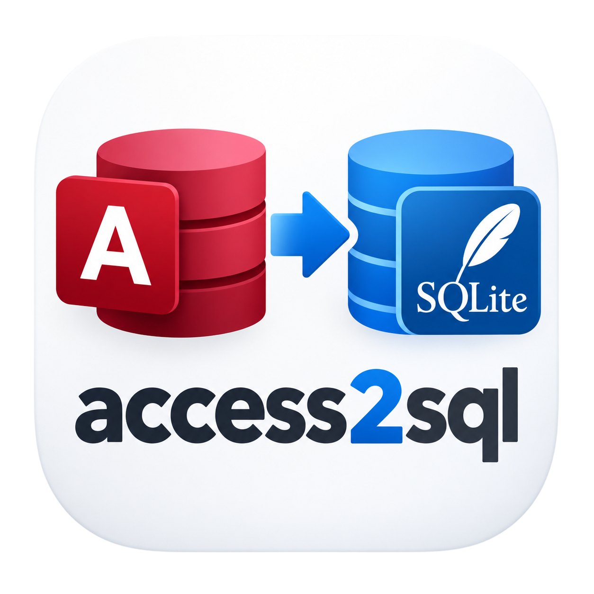

# Access2SQL



**Access2SQL** converts Microsoft Access databases (`.accdb` / `.mdb`) into
SQLite-compatible SQL. You don't need Microsoft Access, and it runs on macOS,
Windows and Linux.

Drop your databases onto the window, choose what to export, and click
**Generate Output**. For each database it can produce:

| File | Contents |
|---|---|
| `<name>.sql` | `DROP TABLE` / `CREATE TABLE` / `INSERT` statements for every table, with primary and foreign keys, ready to run in SQLite (`sqlite3 new.db < name.sql`) |
| `<name>_queries.txt` | All saved Access queries as plain text, one section per query |
| `<name>_queries.md` | The same queries as Markdown: a heading per query and a SQL code block |

## Download

**➜ [Download the latest release](https://github.com/ffasbend/Access2SQL/releases/latest)**

| Platform | File | Notes |
|---|---|---|
| macOS (Apple Silicon) | `Access2SQL-<version>-macOS-arm64.dmg` | Nothing else to install. See [first launch](#macos-opening-the-app-the-first-time) |
| macOS (Intel) | `Access2SQL-<version>-macOS-x86_64.dmg` | Same as above |
| Windows 10/11 (64-bit) | `Access2SQL-<version>-Windows-x64-Setup.exe` | Needs the Microsoft Access Database Engine. See [Windows](#windows-what-you-need) |
| Linux (Debian/Ubuntu, 64-bit) | `Access2SQL-<version>-Linux-amd64.deb` | Needs mdbtools, installed automatically by `apt`. See [Linux](#linux-what-you-need) |

All releases: <https://github.com/ffasbend/Access2SQL/releases>

### macOS: opening the app the first time

The Mac app isn't signed or notarized with an Apple Developer certificate. So on the
first launch, macOS Gatekeeper blocks it with a message like *"Access2SQL" Not Opened*
or *Apple could not verify "Access2SQL" is free of malware*. Allow it once using
**one** of the methods below. After that it opens normally.

**Option 1: System Settings (macOS 15 Sequoia and later)**

1. Double-click **Access2SQL** in Applications. When the warning appears, click **Done**.
2. Open **System Settings → Privacy & Security** and scroll down to **Security**.
3. Next to *"Access2SQL" was blocked to protect your Mac*, click **Open Anyway**.
4. Confirm with **Open Anyway** again and enter your password or use Touch ID.

**Option 2: Right-click → Open (macOS 14 Sonoma and earlier)**

1. In Applications, **right-click** (or Control-click) **Access2SQL** and choose **Open**.
2. In the dialog, click **Open**.

**Option 3: Terminal (all macOS versions)**

This removes the "downloaded from the internet" quarantine flag. It also fixes the
message *"Access2SQL" is damaged and can't be opened*:

```bash
xattr -dr com.apple.quarantine /Applications/Access2SQL.app
```

Then start the app normally.

> Only do this for apps you trust. Access2SQL is open source: the builds are
> made from this repository by [GitHub Actions](.github/workflows/release.yml).

Everything else the Mac app needs (Python, Tk, mdbtools) is bundled, so nothing
else has to be installed.

### Windows: what you need

The Windows app reads Access files through Microsoft's own ODBC driver, which isn't
part of Windows.

1. **Install the Microsoft Access Database Engine 2016 Redistributable (64-bit):**
   <https://www.microsoft.com/en-us/download/details.aspx?id=54920>
   - Choose **`accessdatabaseengine_X64.exe`**. Access2SQL is a 64-bit app, and the
     32-bit driver won't be found.
   - If a **32-bit Microsoft Office** is installed, the setup refuses to install the
     64-bit engine. Install it from a Command Prompt instead:
     ```bat
     accessdatabaseengine_X64.exe /quiet
     ```
   - A full 64-bit Microsoft Access installation already includes the driver.
2. **Run `Access2SQL-<version>-Windows-x64-Setup.exe`.** The installer isn't
   code-signed, so Windows SmartScreen may show *"Windows protected your PC"*. Click
   **More info → Run anyway**.

> **Queries on Windows:** exporting saved queries (`.txt` / `.md`) uses `mdb-queries`
> from [mdbtools](https://github.com/mdbtools/mdbtools), which the Windows app doesn't
> include. On Windows, only the **SQL** output (tables + data) is produced, and the log
> shows *"QUERY skipped"*. Use the Mac or Linux version to export queries.

### Linux: what you need

The Linux package uses [mdbtools](https://github.com/mdbtools/mdbtools) to read Access
files. Python and Tk are bundled.

1. Download `Access2SQL-<version>-Linux-amd64.deb`.
2. Install it with `apt`. This also installs `mdbtools` from your distribution
   automatically:
   ```bash
   sudo apt install ./Access2SQL-<version>-Linux-amd64.deb
   ```
   If you install with `dpkg -i` instead, get the missing dependency afterwards with
   `sudo apt -f install` (or `sudo apt install mdbtools`).
3. Start **Access2SQL** from the application menu, or run `/opt/access2sql/Access2SQL`.

Requirements and notes:

- **64-bit (x86_64) Debian-based distribution** such as Ubuntu, Debian or Linux Mint.
  The package is built on Ubuntu 24.04, so it needs a similarly recent system
  (Ubuntu 24.04+, Debian 13+). Older releases may lack the required glibc version.
- **mdbtools** (with `mdb-queries`, needed for query export). The `mdbtools` package in
  Ubuntu/Debian includes it. Package page: <https://packages.ubuntu.com/mdbtools>
- Other distributions (Fedora, Arch, …): there is no package yet. Install `mdbtools`
  with your package manager and run from source (see
  [Running without the GUI](#running-without-the-gui-command-line-script)).

## Using the app

1. **Add databases.** Drop `.accdb` / `.mdb` files or whole folders onto the file list,
   or use **Browse files…** / **Browse folder…**. Folders are searched recursively.
2. **Choose what to save**, in any combination:
   - **SQL (tables + data)**
   - **Queries as .txt**
   - **Queries as .md**
3. Click **Generate Output**. Progress and results appear in the log.

The output files are saved **next to each source database**. Existing files are never
overwritten; a numeric suffix is added instead (`name_1.sql`, `name_2.sql`, …).
Your checkbox choices are remembered for the next launch.

**? → How to use** in the menu shows these steps inside the app.

## How Access types are converted

| Access | SQLite column |
|---|---|
| Text, Memo, Hyperlink | `TEXT COLLATE NOCASE` |
| AutoNumber, Byte, Integer, Long Integer | `INTEGER` |
| Single, Double, Decimal | `REAL` |
| Currency | `CURRENCY` (REAL affinity) |
| Date/Time | `DATETIME` |
| Yes/No | `BOOLEAN` (values `0` / `1`) |
| OLE Object, Binary | `BLOB` |
| anything else | `TEXT COLLATE NOCASE` |

Tables are created in foreign-key dependency order, so the script loads cleanly
with `PRAGMA foreign_keys=ON`.

## How it reads Access files

- **macOS / Linux:** [mdbtools](https://github.com/mdbtools/mdbtools). The macOS app
  includes it, and the Linux package installs it as a dependency.
- **Windows:** `pyodbc` with the Microsoft Access ODBC driver.

Query export relies on `mdb-queries` from mdbtools. If it isn't available, the query
files are skipped and a message appears in the log.

---

## Running without the GUI (command-line script)

The conversion logic lives in `access2sql.py` and runs on its own.

### How to install

First get the source code:

```bash
git clone https://github.com/ffasbend/Access2SQL.git
cd Access2SQL
```

Then use either Conda (recommended: the easiest setup across machines) or pip.

#### Option A: Conda (recommended)

1. Create the environment. It includes Python, pyodbc, mdbtools, unixODBC and Tk:

   ```bash
   conda env create -f environment.yml
   ```

2. Activate it:

   ```bash
   conda activate access2sql
   ```

3. Run the script:

   ```bash
   python access2sql.py
   ```

#### Option B: pip + system packages

1. Install the Python dependency:

   ```bash
   pip install -r requirements.txt
   ```

2. Install the system tools:

   | Platform | What to install |
   |---|---|
   | macOS (Homebrew) | `brew install mdbtools unixodbc` |
   | Linux (Debian/Ubuntu) | `sudo apt install mdbtools unixodbc` |
   | Windows | [Microsoft Access Database Engine](https://www.microsoft.com/en-us/download/details.aspx?id=54920) (ODBC driver) |

3. Run the script:

   ```bash
   python access2sql.py
   ```

**Notes**

- `tkinter` (used for the folder picker) comes with standard Python on most systems.
  On Linux you may need `sudo apt install python3-tk`.
- The script detects the platform and picks a backend automatically: `pyodbc` if it
  can be imported. On macOS it otherwise falls back to the `mdbtools` command-line
  tools (`mdb-tables`, `mdb-export`, `mdb-schema`, `mdb-queries`), so pyodbc is
  optional there. Windows and Linux need pyodbc.

### What the script does

A folder picker opens (it remembers the last folder you used). The script searches
that folder recursively for `.accdb` / `.mdb` files and writes `<name>.sql` and
`<name>_queries.txt` next to each one.

To start the GUI from source instead of using a release:

```bash
pip install -r requirements_gui.txt
python access2sql_gui.py
```

Building the apps yourself is covered in [readme_build.md](readme_build.md).
